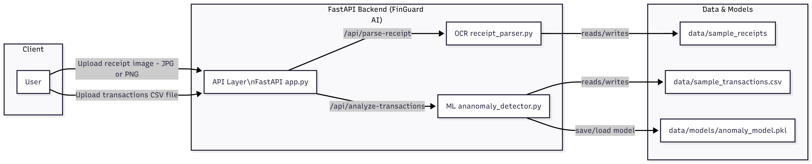

# 🛡️ FinGuard AI  
### Intelligent Expense Auditor & Transaction Anomaly Detection System

FinGuard AI is an AI-powered financial analysis tool that automates receipt extraction, expense categorization, and anomaly detection in financial transactions.  
It combines OCR, Machine Learning, and FastAPI to help individuals and SMEs identify unusual spending patterns, detect potential fraud, and improve their financial visibility.

This project was developed for the AI-Driven Smart Finance Hackathon.

---

## 🚀 Features

### 🔍 1. OCR Receipt Extraction  
Upload images of receipts (JPG/PNG) and extract:
- Merchant name  
- Date  
- Total amount  
- Raw receipt text  

### 🤖 2. Unsupervised Anomaly Detection  
Upload a CSV file of transactions:
- Learns normal spending behavior  
- Detects suspicious transactions  
- Ranks anomalies (0–1)

### ⚡ 3. FastAPI Backend  
REST endpoints for OCR + anomaly scoring with auto Swagger docs.

---

## 🧠 Tech Stack

| Layer | Technology |
|-------|------------|
| Backend API | FastAPI, Uvicorn |
| Frontend | React 19, Vite |
| OCR | Tesseract OCR, OpenCV, Pytesseract |
| ML | Scikit-learn, Pandas, NumPy |
| Language | Python 3.10+ |

---

## 🏗️ System Architecture

> (
)


FinGuard-AI/
├── src/backend/api/ → FastAPI endpoints
├── src/backend/ocr/ → OCR pipeline
├── src/backend/ml/ → anomaly detection
├── data/ → sample data & models
└── README.md


---

## ⚙️ Installation

```bash
git clone https://github.com/<your-username>/FinGuard-AI.git
cd FinGuard-AI
python -m venv .venv
.\.venv\Scripts\activate
pip install -r requirements.txt

Install Tesseract OCR (Windows)

Download installer:
https://github.com/UB-Mannheim/tesseract/wiki

Set the path in receipt_parser.py:

pytesseract.pytesseract.tesseract_cmd = r"C:\ProgramFiles\Tesseract-OCR\tesseract.exe"
```

---


### 🚦 Running the API
```bash
cd src
uvicorn backend.api.app:app --reload

Server runs at:

http://127.0.0.1:8000
http://127.0.0.1:8000/docs
 (Swagger UI)

```
---

### 🧪 API Endpoints
1️⃣ Receipt OCR
POST /api/parse-receipt
Response example:
```bash

{
  "filename": "receipt.jpg",
  "parsed_receipt": {
    "merchant": "Superstore Nairobi",
    "date": "2025-12-05",
    "total_amount": 1450.00
  }
}
```
---
### 2️⃣ Transaction Anomaly Detection
POST /api/analyze-transactions
CSV input::
```bash
transaction_id,date,merchant,category,amount
1,2025-12-01,Supermarket X,Groceries,1450
```
Response:
``` bash
{
  "filename": "transactions.csv",
  "total_transactions": 200,
  "anomalies": [...]
}
```

--- 
### ⚙️ Installation

After cloning and setting up the backend, follow these steps to run the frontend:

Frontend Setup

1. Navigate to the frontend directory:
``` bash
  cd src/frontend
```
2. Install dependencies:
``` bash
npm install
```
3. Start the development server:
``` bash
  npm run dev
```
4. Access the frontend at:
http://localhost:5173


---
### 🔮 Future Improvements
LLM-powered financial summaries
Full frontend dashboard
Cloud deployment
PDF support

---

### 📜 License
MIT License
---

### 👨‍💻 Author
Mitchel Mutuli
